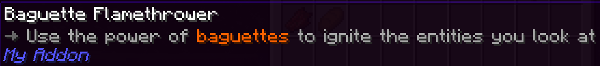

# Advanced lore

## Overview

Let's have a look at some of the other things we can do with item lore. Right now, it's very boring:


---

## Minimessage

Lore isn't just plain text - there are **tags** like `<arrow>` and `<red>` and `<bold>`. These tags are added by [MiniMessage](https://docs.advntr.dev/minimessage/index.html). 

!!! info "You can find a full list of MiniMessage tags [here](https://docs.advntr.dev/minimessage/format.html)."

Here are a few examples of what you can do with minimessage.

### Simple color

```yaml title="en.yml"
baguette_flamethrower:
  name: "Baguette Flamethrower"
  lore: |-
    <arrow> Use the power of <red>baguettes</red> to ignite the entities you look at
```


### Hex color

```yaml title="en.yml"
baguette_flamethrower:
  name: "Baguette Flamethrower"
  lore: |-
    <arrow> Use the power of <#ff6200>baguettes</#ff6200> to ignite the entities you look at
```



### Gradient

```yaml title="en.yml"
baguette_flamethrower:
  name: "Baguette Flamethrower"
  lore: |-
    <arrow> Use the power of <gradient:#0055a4:white:#ef4135>baguettes</gradient> to ignite the entities you look at
```


### Formatting

```yaml title="en.yml"
baguette_flamethrower:
  name: "Baguette Flamethrower"
  lore: |-
    <arrow> Use the <underlined>power of <bold>baguettes</bold> to ignite</underlined> the entities you look at
```


!!! success "Best practice"
    **Avoid using too much color in item lore and names**. Ideally, you shouldn't highlight 'baguette' like we did in the above examples, because there's no practical reason to.

    It can be tempting, but there are so many items in Pylon that it quickly becomes a mess! It's better to use colors and formatting (bold, italics, etc) in **special cases**. For example, the Loupe highlights 'The examined item will be consumed' in red because it's very important to know before using the Loupe!

---

## Pylon's custom tags

The fun doesn't end there - Pylon adds its own MiniMessage tags! You've already met the `<arrow>` tag added by Pylon, which is used all over the place. There are two other very important tags that Pylon adds: `<insn>` (instruction) and `<attr>` (attribute).

!!! info "You can find a full list of Pylon's custom tags [here](TODO)."

### Instructions (`<insn>`)

This tag is just a shorthand to highlight text in a specific color. We use it to indicate an **instruction**:

```yaml title="en.yml" hl_lines="5"
baguette_flamethrower:
  name: "Baguette Flamethrower"
  lore: |-
    <arrow> Use the power of baguettes to ignite the entities you look at
    <arrow> <insn>Right click</insn> to ignite the entity you're looking at
```


### Attributes (`<attr>`)

This is another shorthand for highlighting text in a specific color, this time used for **attributes**:

```yaml title="en.yml" hl_lines="6"
baguette_flamethrower:
  name: "Baguette Flamethrower"
  lore: |-
    <arrow> Use the power of baguettes to ignite the entities you look at
    <arrow> <insn>Right click</insn> to ignite the entity you're looking at
    <arrow> <attr>Burn time:</attr> 2 seconds
```

!!! success "Best practice"
    Put description first, then instructions, then attributes. This helps keep things consistent across all of Pylon's items.


'But hold on!' you say. 'Didn't we just add a setting to change the burn time? It's not necessarily always 2 seconds!'

You'd be correct. And that's where **placeholders** come in.

---

## Placeholders

Sometimes, we need to communicate values from the code to the lore, like the burn time. This can be done with placeholders. A placeholder is just an indicator, like `%burn-time%` which says 'something will be substituted here'.

The `PylonItem` class has a method called `getPlaceholders`. This method - when implemented - returns a list of placeholders to substitute into the item's lore. Let's implement it for BaguetteFlamethrower:

```java title="BaguetteFlamethrower.java" hl_lines="13-18"
public class BaguetteFlamethrower extends PylonItem implements PylonItemEntityInteractor {
    private final int burnTimeTicks = getSettings().getOrThrow("burn-time-ticks", Integer.class);

    public BaguetteFlamethrower(@NotNull ItemStack stack) {
        super(stack);
    }

    @Override
    public void onUsedToRightClickEntity(@NotNull PlayerInteractEntityEvent event) {
        event.getRightClicked().setFireTicks(burnTimeTicks);
    }

    @Override
    public @NotNull List<PylonArgument> getPlaceholders() {
        return List.of(
                PylonArgument.of("burn-time", burnTimeTicks / 20.0)
        );
    }
}
```

Now we can use that placeholder in the item lore. The placeholder is the string you supplied, surrounded by % - so in this case `%burn-time%`:
```yaml title="en.yml" hl_lines="6"
baguette_flamethrower:
  name: "Baguette Flamethrower"
  lore: |-
    <arrow> Use the power of baguettes to ignite the entities you look at
    <arrow> <insn>Right click</insn> to ignite the entity you're looking at
    <arrow> <attr>Burn time:</attr> %burn-time% seconds
```


!!! success "Best practice"
    **Always use placeholders** instead of hardcoding values, so the values in the lore are always correct.

### Units

One final thing. We're currently manually adding 'seconds' - but Pylon has a units API we can use. This API can automatically choose how to format the unit. It's very simple to use:

```java title="BaguetteFlamethrower.java" hl_lines="16"
public class BaguetteFlamethrower extends PylonItem implements PylonItemEntityInteractor {
    private final int burnTimeTicks = getSettings().getOrThrow("burn-time-ticks", Integer.class);

    public BaguetteFlamethrower(@NotNull ItemStack stack) {
        super(stack);
    }

    @Override
    public void onUsedToRightClickEntity(@NotNull PlayerInteractEntityEvent event) {
        event.getRightClicked().setFireTicks(burnTimeTicks);
    }

    @Override
    public @NotNull List<PylonArgument> getPlaceholders() {
        return List.of(
                PylonArgument.of("burn-time", UnitFormat.SECONDS.format(burnTimeTicks / 20.0))
        );
    }
}
```

```yaml title="en.yml" hl_lines="6"
baguette_flamethrower:
  name: "Baguette Flamethrower"
  lore: |-
    <arrow> Use the power of baguettes to ignite the entities you look at
    <arrow> <insn>Right click</insn> to ignite the entity you're looking at
    <arrow> <attr>Burn time:</attr> %burn-time%
```


!!! info "You can find a full list of Pylon's default units [here](https://pylonmc.github.io/pylon-core/docs/javadoc/io/github/pylonmc/pylon/core/util/gui/unit/UnitFormat.html)."

!!! success "Best practice"
    **Use units instead of hardcoding values**, even when it's a simple unit. This means the same unit looks the same across all items, and all values are formatted in the same way. For example, if we hardcoded placeholders, we might end up with '2.0' in some places and '2' in some places depending on whether we use a `float` or `int` - but using the unit API ensures it's always the same.
