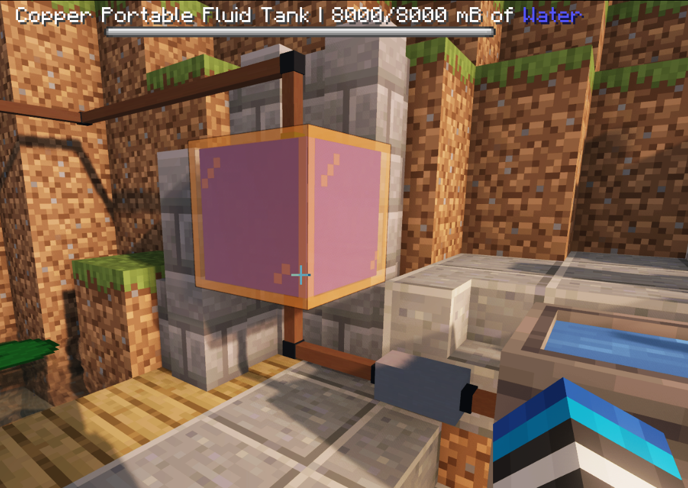
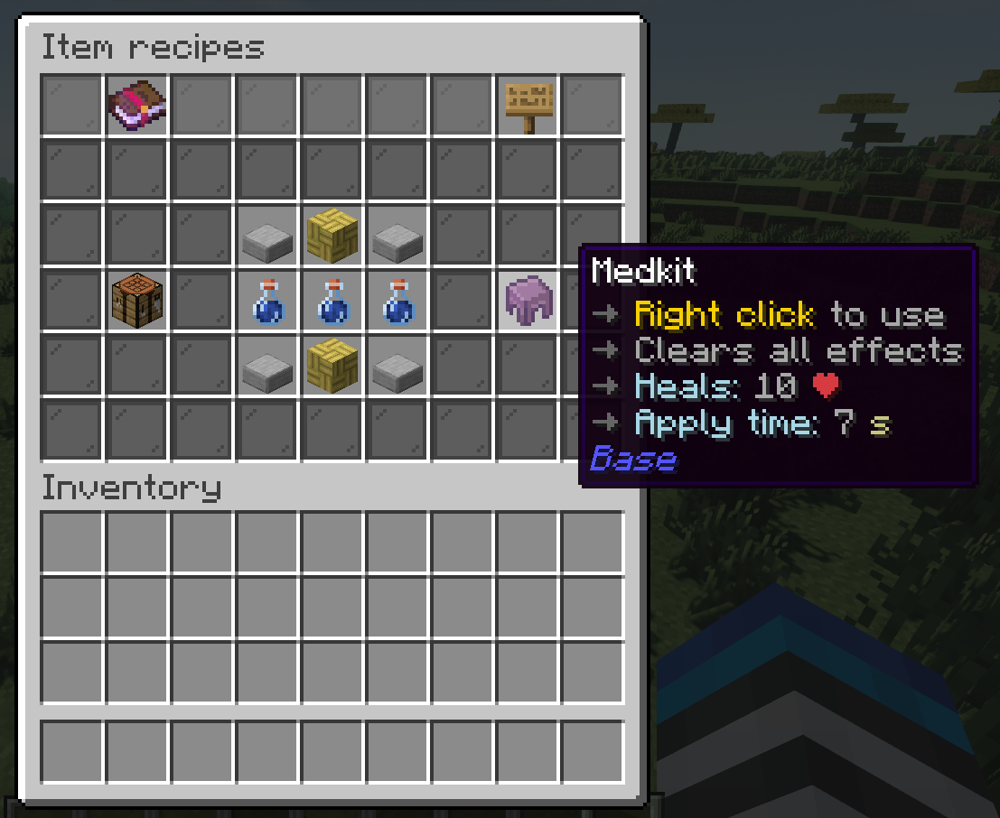
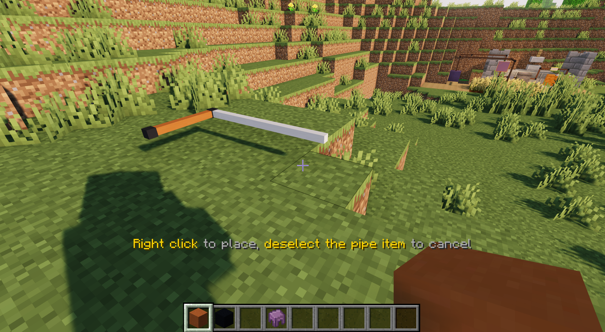
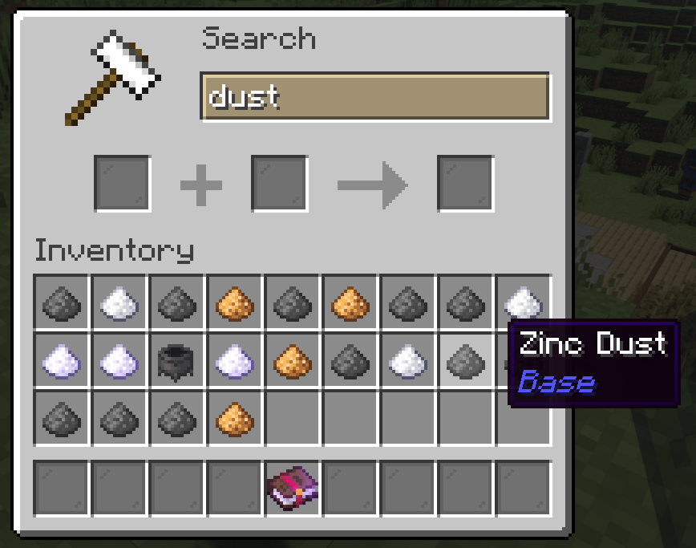
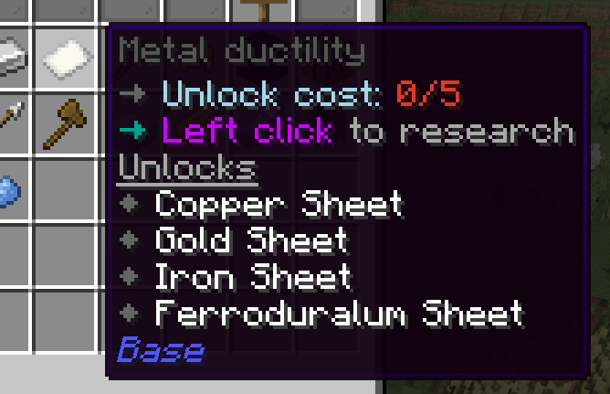

Pylon is an upcoming Minecraft Java technology plugin that will hugely expand vanilla gameplay with new content: electricity, diesel machines, new fluids and fluid pipes, logistics, and much, much more!

[:simple-discord: Join us on Discord :material-arrow-right:](https://discord.gg/4tMAnBAacW){ .md-button } [:simple-github: FInd us on GitHub :material-arrow-right:](https://github.com/pylonmc){ .md-button }

Keep reading to find out more.

---

## :calendar: Where are we at?
| Expected time of completion | Event |
| :-------------------------- | :---- |
| <s>**December 2025**</s> | <s>Most/all diesel machines fully implemented</s> (DONE) |
| <s>**January 2025**</s> | <s>Cargo system fully implemented</s> (DONE) |
| **February 2025** | Open alpha testing (likely hosted on MetaMechanists - my own server) begins. |
| **April 2025** | Electricity fully implemented |
| **Mid 2026** | Pylon officially released |

## :wrench: Pylon's features

| Status | Feature |
| :----- | :------ |
| :white_check_mark: | Manual machines (mixing pot, grindstone, magic altar, hammer, and much more!)
| :white_check_mark: | Hydraulic machines (early-game automation)
| :white_check_mark: | Fluid pipes & new fluids
| :white_check_mark: | Smelting & alloying system
| :white_check_mark: | Multiblocks
| :white_check_mark: | Research system (unlock new items with research points)
| :white_check_mark: | Per-player language support
| :white_check_mark: | Comprehensive and user-friendly in-game guide
| :white_check_mark: | Extensive server customisation options (including per-machine settings and customisable recipes)
| :white_check_mark: | First-class addon support (even all of Pylon's base content is added using an addon!)
| :construction: | Performance tuning options (limit the number of blocks per chunk/player, configure tick rates, etc)
| :construction: | First-class texture pack support + 'official' texture pack (including blocks)
| :construction: | Diesel machines (mid-game automation)
| :construction: | Cargo system (automatically move items from A to B)
| :o: | Electric machines (end-game automation)
| :o: | AE2-style endgame logistics system
| :o: | Builtin profiler for determining what's causing the most lag
| :o: | Bedrock support (via Geyser)

## :frame_photo: Gallery

|    |    |
| :- | :- |
|  |  
|  |  |
|  |  |
|  |  |
|  |  |
|  |  |

## :detective: Meet the team

| Role | Member | Bio |
| ---- | ------ | --- |
| Lead Developer | :flag_us: Seggan | A veteran Slimefun addon developer (SlimefunWarfare, SFCalc, Galactifun), with a impressive contribution record for SF addons, Paper, and Slimefun. Seggan is responsible for many core Pylon systems, including translation, WAILA, researches, the smeltery, the recipe system, and more. |
| Lead Developer | :flag_ca: Ohm | New to plugin development, but has done a fantastic job getting up to speed and adding lots of base content, like talismans and the beheading sword, as well as a *lot* of various smaller technical changes & bug fixes. |
| Lead Developer | :flag_gb: Idra | Owner of a Slimefun server for 5 years & Quaptics developer. I have developed many of the core systems including the Pylon guide, fluid system, hydraulics, cargo, diesel, automated tests, block storage, and more|
| Developer | :flag_it: Vaan | Previously headed a geopolitics server and has been doing a lot of valuable work on the 'smaller stuff' - resolving issues, fixing bugs, adding polishing, making technical changes, and lots more. |
| Developer | :flag_us: Justin | Head developer on my server for 3 years and works professionally in the Minecraft space. He has done the majority of the texture pack support side of Pylon, and other various smaller refinements.
| Artist | :flag_cz: Pandicka | A talented texture pack artist who worked on Slimefun texture packs, and has created the majority of the Pylon resource pack. |
| Contributor | :flag_cn: Balugaq | Former Slimefun addon developer (JustEnoughGuide, SlimefunTimeIt, MSUA, AdvancedBan, and more) who has contributed to Pylon (primarily the recipe ingredient calculation system) and also has already written two addons. |
| Contributor | :flag_us: Blueb | Has run a Slimefun server (Orchid) for several years and has added some neat content like the elevator. |
| Contributor | :flag_cn: Ybw0014 | Former Slimefun addon developer who ran the Slimefun community. Helped with some of the Pylon docs. |

---

## :tools: For server admins

### Performance

- :gear: Even huge multiblocks will have **almost zero** performance impact compared to a normal Pylon block
- :gear: Most of Pylon will eventually run asynchronously
- :gear: Performance is literally built into Pylon's design - systems like fluid pipes and cargo were designed from the ground up in the most performant way possible
- :gear: You will be able to limit the number of each type of block per player or per chunk
- :gear: Pylon will have many more performance options, such as making fluid pipes tick less often, or reducing tick rates of individual types of machines
- :gear: We plan to add a purpose-built profiler so you can see exactly what blocks & items are using the most CPU or memory

### Stability

- :gear: Easily disable any problematic blocks or items
- :gear: Pylon will refuse to start if it detects any configuration issues
- :gear: Blocks that throw errors will be safely unloaded
- :gear: Removing addons is safe, with all the data kept intact and restored if the addon is re-added
- :gear: Pylon data is stored **in the world data itself** - no need to keep extra backups

### Customisation

- :gear: The unlocks and costs of each research are configurable
- :gear: All recipes are configurable
- :gear: Most blocks and items have settings determining their tick rate, speed, diesel usage, etc

---

## :keyboard: For developers

### Addon development

- :gear: Pylon has first-class addon support; all the base content is added using an addon!
- :gear: Pylon supports addons written in Kotlin
- :gear: Blocks, items, recipes, guide pages, fluids, and entities are all easy and intuitive to add
- :gear: Pylon will have extensive high-level documentation on all the features it has to offer

!!! warning "Currently, addon development is not supported due to how rapidly Pylon is still changing."

### Examples

See the following code to get a feel for how Pylon works:

| Example | Link |
| ------- | ---- |
| Portable dustbin | [https://github.com/pylonmc/pylon-base/blob/master/src/main/java/io/github/pylonmc/pylon/base/content/tools/PortableDustbin.java](https://github.com/pylonmc/pylon-base/blob/master/src/main/java/io/github/pylonmc/pylon/base/content/tools/PortableDustbin.java) |
| Fireproof rune | [https://github.com/pylonmc/pylon-base/blob/master/src/main/java/io/github/pylonmc/pylon/base/content/tools/FireproofRune.java](https://github.com/pylonmc/pylon-base/blob/master/src/main/java/io/github/pylonmc/pylon/base/content/tools/FireproofRune.java) |
| Hammer recipe type | [https://github.com/pylonmc/pylon-base/blob/master/src/main/java/io/github/pylonmc/pylon/base/recipes/HammerRecipe.java](https://github.com/pylonmc/pylon-base/blob/master/src/main/java/io/github/pylonmc/pylon/base/recipes/HammerRecipe.java) |
| Hammer recipe files | [https://github.com/pylonmc/pylon-base/blob/master/src/main/resources/recipes/pylonbase/hammer.yml](https://github.com/pylonmc/pylon-base/blob/master/src/main/resources/recipes/pylonbase/hammer.yml) |
| Base English language file | [https://github.com/pylonmc/pylon-base/blob/master/src/main/resources/lang/en.yml](https://github.com/pylonmc/pylon-base/blob/master/src/main/resources/lang/en.yml) |
| Press block | [https://github.com/pylonmc/pylon-base/blob/master/src/main/java/io/github/pylonmc/pylon/base/content/machines/simple/Press.java](https://github.com/pylonmc/pylon-base/blob/master/src/main/java/io/github/pylonmc/pylon/base/content/machines/simple/Press.java) |
| Hydraulic excavator settings | [https://github.com/pylonmc/pylon-base/blob/master/src/main/resources/settings/hydraulic_excavator.yml](https://github.com/pylonmc/pylon-base/blob/master/src/main/resources/settings/hydraulic_excavator.yml) |

---

## :question: Q&A

| Question | Answer |
| -------- | ------ |
| **How do I install Pylon?** | Read the installation guide at [https://pylonmc.github.io/installation/installing-pylon/](https://pylonmc.github.io/installation/installing-pylon/). Beware that **Pylon is still experimental and you should not run it outside of an expendable test server.** |
| **Will Pylon support Slimefun addons?** | No. Migrating from Slimefun to Pylon is non-trivial, and we advise addon developers to rewrite their addons entirely to better suit Pylon's progression and style rather than attempting to migrate them 1-to-1. |
| **What versions will Pylon support?** | We plan to keep each Pylon version compatible with the latest version of Minecraft at the time. To make it easier and faster for us to update, **each version of Pylon will only support one version of Minecraft.** This means you will need to use older versions of Pylon for older versions of Minecraft. Critical fixes will be backported. |
| **What server software can Pylon run on?** | Paper or paper forks only. Folia support may come later down the line. |
| **Will Pylon support bedrock (via Geyser)?** | Eventually, yes, but it is not a high priority and will be one of the last things added. Geyser is very hard for a project like this to support and there will be some jank. |
| **When will Pylon be ready?** | See the 'Provisional Timeline' section above |

**If you have a different question, drop a message on [Discord](https://discord.gg/4tMAnBAacW) and we'll be happy to answer.**
