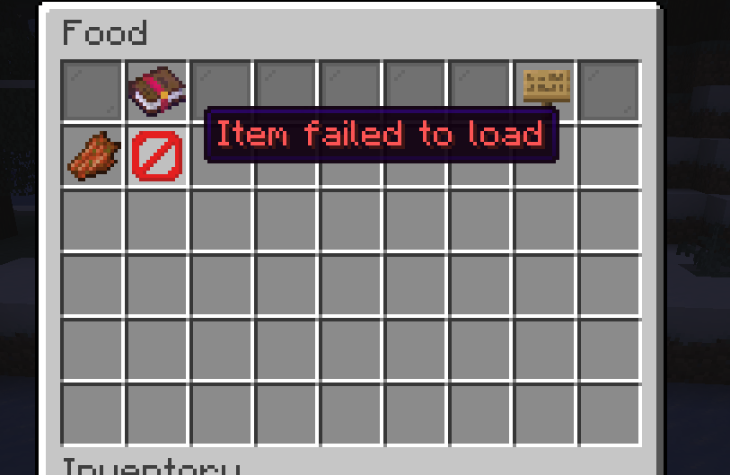
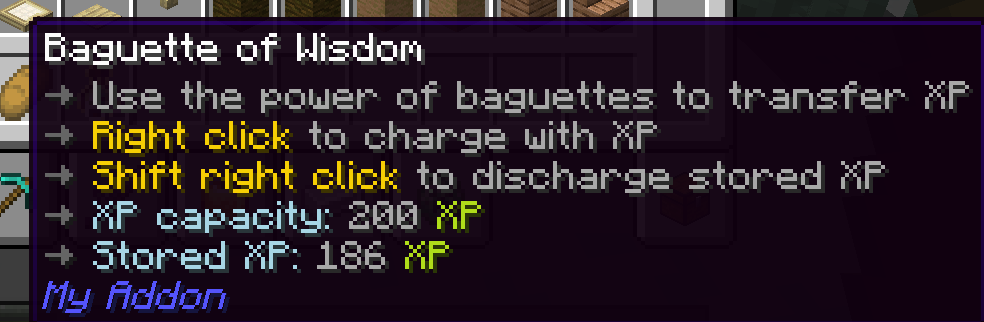

# 持久化資料

## 物品建構子

你可能會以為法棍火焰噴射器的建構子在每次建立物品時都會被呼叫，例如每次我們合成一個法棍。但事實上**並不是如此**。

重要的是要知道，**物品的建構子可以在任意時刻被呼叫，而不僅僅是在物品被「建立」時**。

??? question "等等……為什麼建構子可以任意被呼叫？"
    *(sigh)* 這有點複雜。簡單來說……

    Pylon 無法隨時追蹤每一個物品的狀態。 If we could actually modify the core server code, then this would be possible. Instead, Pylon only *temporarily* track Pylon items.
    
    例如，當我們使用法棍火焰噴射器右鍵點擊一個實體時， Pylon listens to the [PlayerInteractEntityEvent] and sees that an entity has been right clicked with an item. In order to figure out what item it is - and if it's even a Pylon item at all - Pylon has to look at the key stored inside the item. But even if Pylon knows the key, it still don't know much about the item. Does the item implement [PylonItemEntityInteractor]? If so, Pylon needs to call its `onUsedToRightClickEntity`.
    
    這時候建構子就會派上用場。 We can look up what class the item corresponds to - in this case BaguetteFlamethrower - and create a new instance of it. Then, we can call the `onUsedToRightClickEntity` method.

這一切的意思是：**這個類別可以在任何時間被建立或銷毀**。 任何我們儲存在欄位中的資料都是暫時的。

But suppose we want to store the charge level of a portable battery. If we can't store the charge level in a field, where the hell *can* we store it?

---

## 持久化資料 containers (PDCs)

!!! info "PDC 是由 Paper 新增的功能，不是 Pylon。 "
    我們在這裡介紹它，因為在 Pylon 中它幾乎被用於所有持久化資料的儲存（包括方塊與實體）。

[持久化資料 container]s (PDCs) 是一種在物品上持久儲存任意資料的方法。 You can think of them as a similar sort of thing to YAML. You can 'set' keys and you can 'get' keys, and the keys can have different kinds of data - like strings, ints, or even other PDCs.

以追蹤可攜式電池的充電等級為例， We can store the charge level in the `charge_level` key in the item's PDC. It will then be saved when the item is put in a chest, or when the server restarts.

If this is all a bit confusing - don't worry, an example should make it clearer.

---

## 智慧法棍

### 概念

[研究顯示](https://www.youtube.com/watch?v=dQw4w9WgXcQ&list=RDdQw4w9WgXcQ) that those who eat baguettes have a 68% higher IQ on average. 讓我們以此作為外掛模組的靈感。 We'll create a 'Baguette of Wisdom' which allows you to transfer experience from one player to another.

計畫如下：

- The baguette has a maximum XP capacity
- You can right click with the baguette to 'charge' it with experience
- You can shift right click with the baguette to discharge the experience

To do this, we're going to need to keep track of how much experience the baguette has inside of it.

### Creating the item

You know the drill from last time:

=== "Java"
    ```java title="MyAddon.java"
    NamespacedKey baguetteOfWisdomKey = new NamespacedKey(this, "baguette_of_wisdom");
    ItemStack baguetteOfWisdom = ItemStackBuilder.pylonItem(Material.BREAD, baguetteOfWisdomKey)
            .build();
    PylonItem.register(BaguetteOfWisdom.class, baguetteOfWisdom);
    BasePages.FOOD.addItem(baguetteOfWisdomKey);
    ```
=== "Kotlin"
    ```kotlin title="MyAddon.kt"
    val baguetteOfWisdomKey = NamespacedKey(this, "baguette_of_wisdom")
    val baguetteOfWisdom = ItemStackBuilder.pylonItem(Material.BREAD, baguetteOfWisdomKey)
        .build()
    PylonItem.register<BaguetteOfWisdom>(baguetteOfWisdom)
    BasePages.FOOD.addItem(baguetteOfWisdomKey)
    ```

[](this invisible link is important to break up the two code tabs above and below, otherwise the tabs will all be on one line)

=== "Java"
    ```java title="BaguetteOfWisdom.java"
    public class BaguetteOfWisdom extends PylonItem {
        public BaguetteOfWisdom(@NotNull ItemStack stack) {
            super(stack);
        }
    }
    ```
=== "Kotlin"
    ```kotlin title="BaguetteOfWisdom.kt"
    class BaguetteOfWisdom(stack: ItemStack) : PylonItem(stack)
    ```

```yaml title="en.yml"
item:
  baguette_of_wisdom:
    name: "Baguette of Wisdom"
    lore: |-
      <arrow> Use the power of baguettes to transfer XP
```

### 新增經驗值容量設定

Now, let's add a config value for the max XP capacity:

=== "Java"
    ```java title="BaguetteOfWisdom.java" hl_lines="2"
    public class BaguetteOfWisdom extends PylonItem {
        private final int xpCapacity = getSettings().getOrThrow("xp-capacity", Integer.class);
    
        public BaguetteOfWisdom(@NotNull ItemStack stack) {
            super(stack);
        }
    }
    ```
=== "Kotlin"
    ```kotlin title="BaguetteOfWisdom.kt" hl_lines="2"
    class BaguetteOfWisdom(stack: ItemStack) : PylonItem(stack) {
        private val xpCapacity: Int = settings.getOrThrow("xp-capacity", Int::class.java)
    }
    ```

```yaml title="baguette_of_wisdom.yml"
xp-capacity: 200
```

We'll be using this later.

### 改善說明文字（lore）

Let's add some instructions to the lore, and attributes for the max charge and current charge:

```yaml title="en.yml" hl_lines="6-9"
item:
  baguette_of_wisdom:
    name: "Baguette of Wisdom"
    lore: |-
      <arrow> Use the power of baguettes to transfer XP
      <arrow> <insn>Right click</insn> to charge with XP
      <arrow> <insn>Shift right click</insn> to discharge stored XP
      <arrow> <attr>XP capacity:</attr> %xp_capacity%
      <arrow> <attr>Stored XP:</attr> %stored_xp%
```

=== "Java"
    ```java title="BaguetteOfWisdom.java" hl_lines="8-14"
    public class BaguetteOfWisdom extends PylonItem {
        private final int xpCapacity = getSettings().getOrThrow("xp-capacity", Integer.class);
    
        public BaguetteOfWisdom(@NotNull ItemStack stack) {
            super(stack);
        }
    
        @Override
        public @NotNull List<PylonArgument> getPlaceholders() {
            return List.of(
                    PylonArgument.of("xp_capacity", UnitFormat.EXPERIENCE.format(xpCapacity))
                    // TODO add stored_xp placeholder
            );
        }
    }
    ```
=== "Kotlin"
    ```kotlin title="BaguetteOfWisdom.kt" hl_lines="4-7"
    class BaguetteOfWisdom(stack: ItemStack) : PylonItem(stack) {
        private val xpCapacity: Int = settings.getOrThrow("xp-capacity", Int::class.java)

        override fun getPlaceholders() = listOf(
            PylonArgument.of("xp_capacity", UnitFormat.EXPERIENCE.format(xpCapacity))
            // TODO add stored_xp placeholder
        )
    }
    ```

All of this should be familiar from the [advanced lore] section.

### 充能／放能機制

Next, let's allow the player to charge by right clicking, and discharge by shift right clicking.

We can use the [PylonInteractor] class to do this:

=== "Java"
    ```java title="BaguetteOfWisdom.java" hl_lines="1 16-23"
    public class BaguetteOfWisdom extends PylonItem implements PylonInteractor {
        private final int xpCapacity = getSettings().getOrThrow("xp-capacity", Integer.class);
    
        public BaguetteOfWisdom(@NotNull ItemStack stack) {
            super(stack);
        }
    
        @Override
        public @NotNull List<PylonArgument> getPlaceholders() {
            return List.of(
                    PylonArgument.of("xp_capacity", UnitFormat.EXPERIENCE.format(xpCapacity))
                    // TODO add stored_xp placeholder
            );
        }
    
        @Override
        public void onUsedToRightClick(@NotNull PlayerInteractEvent event) {
            if (event.getPlayer().isSneaking()) {
                // TODO discharge logic
            } else {
                // TODO charge logic
            }
        }
    }
    ```
=== "Kotlin"
    ```kotlin title="BaguetteOfWisdom.kt" hl_lines="1 9-15"
    
    class BaguetteOfWisdom(stack: ItemStack) : PylonItem(stack), PylonInteractor {
        private val xpCapacity: Int = settings.getOrThrow("xp-capacity", Int::class.java)

        override fun getPlaceholders() = listOf(
            PylonArgument.of("xp_capacity", UnitFormat.EXPERIENCE.format(xpCapacity))
            // TODO add stored_xp placeholder
        )

        override fun onUsedToRightClick(event: PlayerInteractEvent) {
            if (event.player.isSneaking) {
                // TODO discharge logic
            } else {
                // TODO charge logic
            }
        }
    }
    ```

### 充能邏輯

Let's now do the **charge** logic. In order to charge a Baguette of Wisdom, we need to store its charge level. As mentioned beforehand, we can use the item's [persistent data container] to do this. To start with, let's just set the charge level to 50:

=== "Java"
    ```java title="BaguetteOfWisdom.java" hl_lines="6-10"
    @Override
    public void onUsedToRightClick(@NotNull PlayerInteractEvent event) {
        if (event.getPlayer().isSneaking()) {
            // TODO discharge logic
        } else {
            getStack().editPersistentDataContainer(pdc -> pdc.set(
                    new NamespacedKey(MyAddon.getInstance(), "stored_xp"),
                    PylonSerializers.INTEGER,
                    50
            ));
        }
    }
    ```
=== "Kotlin"
    ```kotlin title="BaguetteOfWisdom.kt" hl_lines="5-11"
    override fun onUsedToRightClick(event: PlayerInteractEvent) {
        if (event.player.isSneaking) {
            // TODO discharge logic
        } else {
            stack.editPersistentDataContainer { pdc ->
                pdc.set(
                    NamespacedKey(MyAddon.instance, "stored_xp"),
                    PylonSerializers.INTEGER,
                    50
                )
            }
        }
    }
    ```

As you can see, we need to provide three things to set a PDC value: the **key**, the **serializer**, and the **value**. 

The serializer is just a 'thing' that describes how to convert your type into a more primitive type that can be stored on disk - we won't go into details. You need a serializer for every type that you want to store - so you can't store, for example, `MyAddon` in a persistent data container as there is no serializer for it and it doesn't make sense to create one anyway.

!!! info "You can find a full list of serializers [here](https://pylonmc.github.io/pylon-core/docs/javadoc/io/github/pylonmc/pylon/core/datatypes/PylonSerializers.html)"

Ok. But what we really need to do is 'top up' the stored xp using the player's experience:

1. Read how much XP we already have stored
2. Figure out how much XP we need to take to get to `xpCapacity`
3. Take as much XP from the player as we can to get there
4. Set the new XP amount

=== "Java"
    ```java title="BaguetteOfWisdom.java" hl_lines="6-24"
    @Override
    public void onUsedToRightClick(@NotNull PlayerInteractEvent event) {
        if (event.getPlayer().isSneaking()) {
            // TODO discharge logic
        } else {
            // 1. Read how much XP we already have stored
            int xp = getStack().getPersistentDataContainer().get(
                    new NamespacedKey(MyAddon.getInstance(), "stored_xp"),
                    PylonSerializers.INTEGER
            );
            
            // 2. Figure out how much XP we need to take to get to `xpCapacity`
            int extraXpNeeded = xpCapacity - xp;
    
            // 3. Take as much XP from the player as we can to get there
            int xpToTake = Math.min(event.getPlayer().calculateTotalExperiencePoints(), extraXpNeeded);
            event.getPlayer().giveExp(-xpToTake);
    
            // 4. Set the new stored XP amount
            getStack().editPersistentDataContainer(pdc -> pdc.set(
                    new NamespacedKey(MyAddon.getInstance(), "stored_xp"),
                    PylonSerializers.INTEGER,
                    xp + xpToTake
            ));
        }
    }
    ```
=== "Kotlin"
    ```kotlin title="BaguetteOfWisdom.kt" hl_lines="5-25"
    override fun onUsedToRightClick(event: PlayerInteractEvent) {
        if (event.player.isSneaking) {
            // TODO discharge logic
        } else {
            // 1. Read how much XP we already have stored
            val xp = stack.persistentDataContainer.get(
                NamespacedKey(MyAddon.instance, "stored_xp"),
                PylonSerializers.INTEGER
            )!!
            
            // 2. Figure out how much XP we need to take to get to `xpCapacity`
            val extraXpNeeded = xpCapacity - xp

            // 3. Take as much XP from the player as we can to get there
            val xpToTake = min(event.player.calculateTotalExperiencePoints(), extraXpNeeded)
            event.player.giveExp(-xpToTake)

            // 4. Set the new stored XP amount
            stack.editPersistentDataContainer { pdc ->
                pdc.set(
                    NamespacedKey(MyAddon.instance, "stored_xp"),
                    PylonSerializers.INTEGER,
                    xp + xpToTake
                )
            }
        }
    }
    ```

### 放能邏輯

And now for the discharge logic, which is quite similar:

=== "Java"
    ```java title="BaguetteOfWisdom.java" hl_lines="4-18"
    @Override
    public void onUsedToRightClick(@NotNull PlayerInteractEvent event) {
        if (event.getPlayer().isSneaking()) {
            // 1. Read how much XP we have stored
            int xp = getStack().getPersistentDataContainer().get(
                new NamespacedKey(MyAddon.getInstance(), "stored_xp"),
                PylonSerializers.INTEGER
            );
    
            // 2. Give all the XP to the player
            event.getPlayer().giveExp(xp);
    
            // 3. Set the stored XP to 0
            getStack().editPersistentDataContainer(pdc -> pdc.set(
                new NamespacedKey(MyAddon.getInstance(), "stored_xp"),
                PylonSerializers.INTEGER,
                0
            ));
        } else {
            ...
        }
    }
    ```
=== "Kotlin"
    ```kotlin title="BaguetteOfWisdom.kt" hl_lines="3-19"
    override fun onUsedToRightClick(event: PlayerInteractEvent) {
        if (event.player.isSneaking) {
            // 1. Read how much XP we have stored
            val xp = stack.persistentDataContainer.get(
                NamespacedKey(MyAddon.instance, "stored_xp"),
                PylonSerializers.INTEGER
            )!!

            // 2. Give all the XP to the player
            event.player.giveExp(xp)

            // 3. Set the stored XP to 0
            stack.editPersistentDataContainer { pdc ->
                pdc.set(
                    NamespacedKey(MyAddon.instance, "stored_xp"),
                    PylonSerializers.INTEGER,
                    0
                )
            }
        } else {
            ...
        }
    }
    ```

### 新增佔位符（placeholder）

Finally, let's add in the placeholder for the stored charge:

=== "Java"
    ```java title="BaguetteOfWisdom.java" hl_lines="5-10"
    @Override
    public @NotNull List<PylonArgument> getPlaceholders() {
        return List.of(
                PylonArgument.of("xp_capacity", UnitFormat.EXPERIENCE.format(xpCapacity)),
                PylonArgument.of("stored_xp", UnitFormat.EXPERIENCE.format(
                        getStack().getPersistentDataContainer().get(
                                new NamespacedKey(MyAddon.getInstance(), "stored_xp"),
                                PylonSerializers.INTEGER
                        ))
                )
        );
    }
    ```
=== "Kotlin"
    ```kotlin title="BaguetteOfWisdom.kt" hl_lines="3-8"
    override fun getPlaceholders() = listOf(
        PylonArgument.of("xp_capacity", UnitFormat.EXPERIENCE.format(xpCapacity)),
        PylonArgument.of("stored_xp", UnitFormat.EXPERIENCE.format(
            stack.persistentDataContainer.get(
                NamespacedKey(MyAddon.instance, "stored_xp"),
                PylonSerializers.INTEGER
            )!!
        ))
    )
    ```

### 測試功能

Now let's start the server and test our glorious new item. Try giving yourself a Baguette of Wisdom.

Obviously, as I am an expert programmer, it will work perfectly the first time and nothing will go wro- *huh*?



What nonsense is this? Have the brits sabotaged us again?!

When something like this happens, your first port of call should always be the server console to see if any errors have been logged. And indeed, if you have a look in the console you should find the following error:

```title="console"
[12:51:22 WARN]: java.lang.NullPointerException: Cannot invoke "java.lang.Float.floatValue()" because the return value of "io.papermc.paper.persistence.PersistentDataContainerView.get(org.bukkit.NamespacedKey, org.bukkit.persistence.PersistentDataType)" is null
[12:51:22 WARN]: 	at my-addon-MODIFIED-1757418660070.jar//io.github.pylonmc.myaddon.BaguetteOfWisdom.getPlaceholders(BaguetteOfWisdom.java:28)
[12:51:22 WARN]: 	at pylon-core-0.11.2.jar//io.github.pylonmc.pylon.core.guide.button.ItemButton.getItemProvider(ItemButton.kt:47)
[12:51:22 WARN]: 	at xyz.xenondevs.invui.gui.SlotElement$ItemSlotElement.getItemStack(SlotElement.java:44)
[12:51:22 WARN]: 	at xyz.xenondevs.invui.window.AbstractWindow.redrawItem(AbstractWindow.java:109)
[12:51:22 WARN]: 	at xyz.xenondevs.invui.window.AbstractSingleWindow.initItems(AbstractSingleWindow.java:58)
[12:51:22 WARN]: 	at xyz.xenondevs.invui.window.AbstractWindow.open(AbstractWindow.java:279)
[12:51:22 WARN]: 	at xyz.xenondevs.invui.window.AbstractWindow$AbstractBuilder.open(AbstractWindow.java:679)
[12:51:22 WARN]: 	at pylon-core-0.11.2.jar//io.github.pylonmc.pylon.core.guide.pages.base.GuidePage.open(GuidePage.kt:28)
[12:51:22 WARN]: 	at pylon-core-0.11.2.jar//io.github.pylonmc.pylon.core.guide.button.PageButton.handleClick(PageButton.kt:38)
[12:51:22 WARN]: 	at xyz.xenondevs.invui.gui.AbstractGui.handleClick(AbstractGui.java:95)
[12:51:22 WARN]: 	at xyz.xenondevs.invui.window.AbstractSingleWindow.handleClick(AbstractSingleWindow.java:84)
[12:51:22 WARN]: 	at xyz.xenondevs.invui.window.AbstractWindow.handleClickEvent(AbstractWindow.java:199)
[12:51:22 WARN]: 	at xyz.xenondevs.invui.window.WindowManager.handleInventoryClick(WindowManager.java:117)
[12:51:22 WARN]: 	at co.aikar.timings.TimedEventExecutor.execute(TimedEventExecutor.java:80)
[12:51:22 WARN]: 	at org.bukkit.plugin.RegisteredListener.callEvent(RegisteredListener.java:71)
[12:51:22 WARN]: 	at io.papermc.paper.plugin.manager.PaperEventManager.callEvent(PaperEventManager.java:54)
[12:51:22 WARN]: 	at io.papermc.paper.plugin.manager.PaperPluginManagerImpl.callEvent(PaperPluginManagerImpl.java:131)
[12:51:22 WARN]: 	at org.bukkit.plugin.SimplePluginManager.callEvent(SimplePluginManager.java:628)
[12:51:22 WARN]: 	at net.minecraft.server.network.ServerGamePacketListenerImpl.handleContainerClick(ServerGamePacketListenerImpl.java:3208)
[12:51:22 WARN]: 	at net.minecraft.network.protocol.game.ServerboundContainerClickPacket.handle(ServerboundContainerClickPacket.java:59)
[12:51:22 WARN]: 	at net.minecraft.network.protocol.game.ServerboundContainerClickPacket.handle(ServerboundContainerClickPacket.java:14)
[12:51:22 WARN]: 	at net.minecraft.network.protocol.PacketUtils.lambda$ensureRunningOnSameThread$0(PacketUtils.java:29)
[12:51:22 WARN]: 	at net.minecraft.server.TickTask.run(TickTask.java:18)
[12:51:22 WARN]: 	at net.minecraft.util.thread.BlockableEventLoop.doRunTask(BlockableEventLoop.java:155)
[12:51:22 WARN]: 	at net.minecraft.util.thread.ReentrantBlockableEventLoop.doRunTask(ReentrantBlockableEventLoop.java:24)
[12:51:22 WARN]: 	at net.minecraft.server.MinecraftServer.doRunTask(MinecraftServer.java:1450)
[12:51:22 WARN]: 	at net.minecraft.server.MinecraftServer.doRunTask(MinecraftServer.java:176)
[12:51:22 WARN]: 	at net.minecraft.util.thread.BlockableEventLoop.pollTask(BlockableEventLoop.java:129)
[12:51:22 WARN]: 	at net.minecraft.server.MinecraftServer.pollTaskInternal(MinecraftServer.java:1430)
[12:51:22 WARN]: 	at net.minecraft.server.MinecraftServer.pollTask(MinecraftServer.java:1424)
[12:51:22 WARN]: 	at net.minecraft.util.thread.BlockableEventLoop.managedBlock(BlockableEventLoop.java:139)
[12:51:22 WARN]: 	at net.minecraft.server.MinecraftServer.managedBlock(MinecraftServer.java:1381)
[12:51:22 WARN]: 	at net.minecraft.server.MinecraftServer.waitUntilNextTick(MinecraftServer.java:1389)
[12:51:22 WARN]: 	at net.minecraft.server.MinecraftServer.runServer(MinecraftServer.java:1266)
[12:51:22 WARN]: 	at net.minecraft.server.MinecraftServer.lambda$spin$2(MinecraftServer.java:310)
```

Wow. That's a fat error. But the lines we are most interested in are right at the top:

```title="console"
[12:51:22 WARN]: java.lang.NullPointerException: Cannot invoke "java.lang.Float.floatValue()" because the return value of "io.papermc.paper.persistence.PersistentDataContainerView.get(org.bukkit.NamespacedKey, org.bukkit.persistence.PersistentDataType)" is null
[12:51:22 WARN]: 	at my-addon-MODIFIED-1757418660070.jar//io.github.pylonmc.myaddon.BaguetteOfWisdom.getPlaceholders(BaguetteOfWisdom.java:28)
```

So it looks like the error occurred on line 28, in the `getPlaceholders` function, where we try to read from the persistent data container. Apparently, the 'stored_xp' key couldn't be found in the PDC, because the call to `getStack().getPersistentDataContainer().get(...)` returned null.

!!! question "Wait, why did `getPlaceholders` get called and error *now*? We haven't given ourselves the item yet."
    Simply put, the guide also needs to call `getPlaceholders` to display the item to you. The error only appears once you open the guide - or once you give yourself the item with `/py give`.

!!! Note "Null safety"
    If you've been following along in Kotlin, you may have noticed that your error is different from the one above. Additionally, if you played around with the code a bit, you may have noticed that the Kotlin code refuses to compile unless you add a `!!` after the call to `get(...)` in the `getPlaceholders` function. This is because Kotlin actually tracks nulls in the type system, and will error during compile time instead of run time if you try to use a potentially null value without checking for null first. The `!!` tells the compiler, "hey, I know what I'm doing, this value will never be null." This is one of the advantages of using Kotlin over Java, as it can help catch potential null pointer exceptions before they even happen, and is one of the reasons why Pylon Core is written in Kotlin. In this situation, an Elvis operator (`?:`) or a call to `getOrDefault` would have been more appropriate, but for the purposes of this tutorial, we will leave it as is.

This actually makes perfect sense if you think about it. At no point do we set a default value for the stored XP, so of course any call to get it will return null.

### 新增預設值

To add a default value for stored XP to the PDC, we can modify the itemstack itself when we create it:

=== "Java"
    ```java title="MyAddon.java" hl_lines="3-7"
    NamespacedKey baguetteOfWisdomKey = new NamespacedKey(this, "baguette_of_wisdom");
    ItemStack baguetteOfWisdom = ItemStackBuilder.pylonItem(Material.BREAD, baguetteOfWisdomKey)
            .editPdc(pdc -> pdc.set(
                    new NamespacedKey(this, "stored_xp"),
                    PylonSerializers.INTEGER,
                    0
            ))
            .build();
    PylonItem.register(BaguetteOfWisdom.class, baguetteOfWisdom);
    BasePages.FOOD.addItem(baguetteOfWisdomKey);
    ```
=== "Kotlin"
    ```kotlin title="MyAddon.kt" hl_lines="3-9"
    val baguetteOfWisdomKey = NamespacedKey(this, "baguette_of_wisdom")
    val baguetteOfWisdom = ItemStackBuilder.pylonItem(Material.BREAD, baguetteOfWisdomKey)
        .editPdc { pdc ->
            pdc.set(
                NamespacedKey(this, "stored_xp"),
                PylonSerializers.INTEGER,
                0
            )
        }
        .build()
    PylonItem.register<BaguetteOfWisdom>(baguetteOfWisdom)
    BasePages.FOOD.addItem(baguetteOfWisdomKey)
    ```

Now let's try again.



Ah, perfect!

One last thing left to do...

### 程式整理與優化

智慧法棍 works, but there are some improvements we can make.

First, we could pull out the get/set code into their own functions:

=== "Java"
    ```java title="BaguetteOfWisdom.java" hl_lines="4-10 12-17"
    public class BaguetteOfWisdom extends PylonItem implements PylonInteractor {
        ...
    
        public void setStoredXp(int xp) {
            getStack().editPersistentDataContainer(pdc -> pdc.set(
                    new NamespacedKey(MyAddon.getInstance(), "stored_xp"),
                    PylonSerializers.INTEGER,
                    xp
            ));
        }
    
        public int getStoredXp() {
            return getStack().getPersistentDataContainer().get(
                    new NamespacedKey(MyAddon.getInstance(), "stored_xp"),
                    PylonSerializers.INTEGER
            );
        }
    }
    ```
=== "Kotlin"
    ```kotlin title="BaguetteOfWisdom.kt" hl_lines="4-17"
    class BaguetteOfWisdom(stack: ItemStack) : PylonItem(stack), PylonInteractor {
        ...

        var storedXp: Int
            get() = stack.persistentDataContainer.get(
                NamespacedKey(MyAddon.instance, "stored_xp"),
                PylonSerializers.INTEGER
            )!!
            set(value) {
                stack.editPersistentDataContainer { pdc ->
                    pdc.set(
                        NamespacedKey(MyAddon.instance, "stored_xp"),
                        PylonSerializers.INTEGER,
                        value
                    )
                }
            }
    }
    ```

    !!! Note "Delegate"
        Alternatively, Pylon provides a property delegate for persistent data values that can be used to simplify this even further:
        
        ```kotlin title="BaguetteOfWisdom.kt" hl_lines="4-8"
        class BaguetteOfWisdom(stack: ItemStack) : PylonItem(stack), PylonInteractor {
            ...
    
            var storedXp: Int by persistentData(
                NamespacedKey(MyAddon.instance, "stored_xp"),
                PylonSerializers.INTEGER,
                0
            )
        }
        ```

And now, we can use these functions in the rest of the code, which is much cleaner:

=== "Java"
    ```java title="BaguetteOfWisdom.java" hl_lines="9 17 23 26 36"
    public class BaguetteOfWisdom extends PylonItem implements PylonInteractor {
    
        ...
    
        @Override
        public @NotNull List<PylonArgument> getPlaceholders() {
            return List.of(
                    PylonArgument.of("xp_capacity", UnitFormat.EXPERIENCE.format(xpCapacity)),
                    PylonArgument.of("stored_xp", UnitFormat.EXPERIENCE.format(getStoredXp()))
            );
        }
    
        @Override
        public void onUsedToRightClick(@NotNull PlayerInteractEvent event) {
            if (event.getPlayer().isSneaking()) {
                // 1. Read how much XP we already have stored
                int xp = getStoredXp();
    
                // 2. Give all the XP to the player
                event.getPlayer().giveExp(xp);
    
                // 3. Set the stored XP to 0
                setStoredXp(0);
            } else {
                // 1. Read how much XP we already have stored
                int xp = getStoredXp();
    
                // 2. Figure out how much XP we need to take to get to `xpCapacity`
                int extraXpNeeded = xpCapacity - xp;
    
                // 3. Take as much XP from the player as we can to get there
                int xpToTake = Math.min(event.getPlayer().calculateTotalExperiencePoints(), extraXpNeeded);
                event.getPlayer().giveExp(-xpToTake);
    
                // 4. Set the new stored XP amount
                setStoredXp(xp + xpToTake);
            }
        }
    
        ...
    }
    ```
=== "Kotlin"
    
    ```kotlin title="BaguetteOfWisdom.kt" hl_lines="7 13 19 22 32"
    class BaguetteOfWisdom(stack: ItemStack) : PylonItem(stack), PylonInteractor {
    
        ...
    
        override fun getPlaceholders() = listOf(
            PylonArgument.of("xp_capacity", UnitFormat.EXPERIENCE.format(xpCapacity)),
            PylonArgument.of("stored_xp", UnitFormat.EXPERIENCE.format(storedXp))
        )
    
        override fun onUsedToRightClick(event: PlayerInteractEvent) {
            if (event.player.isSneaking) {
                // 1. Read how much XP we already have stored
                val xp = storedXp

                // 2. Give all the XP to the player
                event.player.giveExp(xp)

                // 3. Set the stored XP to 0
                storedXp = 0
            } else {
                // 1. Read how much XP we already have stored
                val xp = storedXp

                // 2. Figure out how much XP we need to take to get to `xpCapacity`
                val extraXpNeeded = xpCapacity - xp

                // 3. Take as much XP from the player as we can to get there
                val xpToTake = min(event.player.calculateTotalExperiencePoints(), extraXpNeeded)
                event.player.giveExp(-xpToTake)

                // 4. Set the new stored XP amount
                storedXp = xp + xpToTake
            }
        }
    
        ...
    }
    ```

The second thing we should do is reuse NamespacedKeys. This is more of a 'best practice' thing - it's generally recommend to reuse keys. It'll become more apparent why later on.

=== "Java"
    ```java title="BaguetteOfWisdom.java" hl_lines="2 8 16"
    public class BaguetteOfWisdom extends PylonItem implements PylonInteractor {
        public static final NamespacedKey STORED_XP_KEY = new NamespacedKey(MyAddon.getInstance(), "stored_xp");
    
        ...
        
        public void setStoredXp(int xp) {
            getStack().editPersistentDataContainer(pdc -> pdc.set(
                    STORED_XP_KEY,
                    PylonSerializers.INTEGER,
                    xp
            ));
        }
    
        public int getStoredXp() {
            return getStack().getPersistentDataContainer().get(
                    STORED_XP_KEY,
                    PylonSerializers.INTEGER
            );
        }
    ```
=== "Kotlin"
    ```kotlin title="BaguetteOfWisdom.kt" hl_lines="2-4 10 16"
    class BaguetteOfWisdom(stack: ItemStack) : PylonItem(stack), PylonInteractor {
        companion object {
            val STORED_XP_KEY = NamespacedKey(MyAddon.instance, "stored_xp")
        }
    
        ...
    
        var storedXp: Int
            get() = stack.persistentDataContainer.get(
                STORED_XP_KEY,
                PylonSerializers.INTEGER
            )!!
            set(value) {
                stack.editPersistentDataContainer { pdc ->
                    pdc.set(
                        STORED_XP_KEY,
                        PylonSerializers.INTEGER,
                        value
                    )
                }
            }
    ```

[](another tab break)

=== "Java"
    ```java title="MyAddon.java" hl_lines="3"
    ItemStack baguetteOfWisdom = ItemStackBuilder.pylonItem(Material.BREAD, baguetteOfWisdomKey)
            .editPdc(pdc -> pdc.set(
                    BaguetteOfWisdom.STORED_XP_KEY,
                    PylonSerializers.INTEGER,
                    0
            ))
            .build();
    ```
=== "Kotlin"
    ```kotlin title="MyAddon.kt" hl_lines="4"
    val baguetteOfWisdom = ItemStackBuilder.pylonItem(Material.BREAD, baguetteOfWisdomKey)
        .editPdc { pdc ->
            pdc.set(
                BaguetteOfWisdom.STORED_XP_KEY,
                PylonSerializers.INTEGER,
                0
            )
        }
        .build()
    ```

完成！

[PlayerInteractEntityEvent]: https://jd.papermc.io/paper/1.21.8/org/bukkit/event/player/PlayerInteractEntityEvent.html
[PylonItemEntityInteractor]: https://pylonmc.github.io/pylon-core/docs/javadoc/io/github/pylonmc/pylon/core/item/base/PylonItemEntityInteractor.html
[持久化資料 container]: https://docs.papermc.io/paper/dev/pdc/
[advanced lore]: advanced-lore.md
[PylonInteractor]: https://pylonmc.github.io/pylon-core/docs/javadoc/io/github/pylonmc/pylon/core/item/base/PylonInteractor.html
