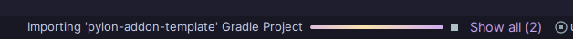

# 入門指南（Getting started）

!!! danger
    目前 **Pylon 插件（addon）開發尚未受到正式支援**。  
    Pylon 正在快速變動中，因此你的外掛在下一次版本更新時可能會以悲慘的方式壞掉。  
    你仍然可以開發外掛，但請注意，為了維持相容性，你可能需要做出重大修改。

---

## 前言（Foreword）

想撰寫一個 Pylon 插件嗎？太棒了！  
我們撰寫了這份完整的指南，盡可能讓整個過程變得簡單。  
不要被長篇文字嚇到——我們會一步步解釋所有內容，你可以慢慢來。  

不過，這仍然需要基本的技術與程式知識。  
如果你從未使用過 IDE、編譯器，或從沒寫過 `for` 迴圈，那可能會有些吃力。  
若你有插件開發經驗，將會大大受益。

在開始之前，先來點前置準備……

---

### 先決條件（Prerequisites）

我們假設你已經：

- 了解 Java 程式設計的基礎。  
- 擁有一個 **GitHub 帳號**，並能在電腦上使用 git。  
  若你是新手，建議使用 [GitHub Desktop](https://github.com/apps/desktop)。  
- 已安裝並設定好 [IntelliJ](https://www.jetbrains.com/idea/)，並對其基本操作有一定概念。

雖然沒有外掛開發經驗也可以跟上，但有經驗會更順利！

---

### Core vs Base（核心與基礎的區別）

在開始之前，你需要了解 **Core** 與 **Base** 的差異。

- **Pylon Core** 是一個函式庫（library），提供建立新方塊、實體等功能。  
- **Pylon Base** 則是一個外掛（addon），提供了「基礎內容」。

在開發外掛時，你很可能會同時用到這兩者。

---

### 關於 Kotlin 的說明（A note on Kotlin）

雖然你可以使用 Java 撰寫外掛，但若你是有經驗的 Java 開發者，可能會對 [Kotlin](https://kotlinlang.org/) 感興趣。  

Kotlin 是 Java 的替代語言，語法更簡潔、特性更現代（例如 null 安全與函式擴展），而且少了許多 Java 的繁瑣之處。  
值得一提的是，**Pylon Core 本身就是用 Kotlin 撰寫的**。

那麼，讓我們開始吧！

---

## 開發環境設定（Setting up）

### Fork 模板（Forking the template）

Pylon 官方提供了一個 [外掛模板（addon template）](https://github.com/pylonmc/pylon-addon-template)，  
它包含了撰寫 Pylon 外掛所需的所有基本設定。  

1. [建立該模板的 Fork](https://www.geeksforgeeks.org/git/how-to-fork-a-github-repository/)。  
2. [Clone 你自己的 Fork 到本機](https://www.geeksforgeeks.org/git/how-to-git-clone-a-remote-repository/)。  

接著，用 IntelliJ 開啟這個專案。  
第一次開啟時，IntelliJ 可能需要幾分鐘來匯入項目。

---

### 模板內容介紹（What's in the template?）

此模板設計極為精簡，不包含任何多餘內容。  
它是使用 [Gradle](https://gradle.org/) 建構的。  

在專案根目錄中，你會看到兩個檔案：  
`gradlew` 與 `gradlew.bat` —— 這是 Gradle 的啟動包裝器。  
若你使用 IntelliJ，通常無需手動操作它們。  

還有一個重要檔案是 `build.gradle.kts`，  這是 Kotlin 語法格式的建構設定檔。  
若要新增依賴或修改專案建構方式，就要修改這裡。

此外，你需要特別注意兩個檔案：
- `build.gradle.kts`  
- `gradle.properties`  

這兩個檔案記錄了專案的主要資訊：名稱、版本、Pylon Core 版本、主類別（main class）與群組（group）。  
請務必依你的外掛內容調整這些資訊。  

若你不確定「主類別」與「群組」是什麼，  
可參考這篇文章：[Java Packages Explained](https://www.baeldung.com/java-packages)。

最後，我們會看到 `MyAddon.java` —— 這是關鍵檔案！  
打開它後，我們會在下一章繼續教學。
