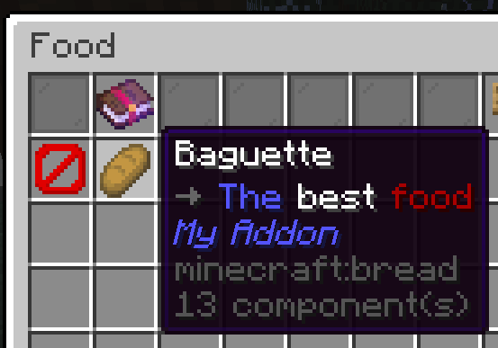

# 使用語言系統（Using the language system）

## 什麼是語言系統？（What is the language system?）

「語言系統」這個詞聽起來可能有點嚇人，但其實非常簡單。  
語言系統只是讓內容**可以被翻譯**的一種方式。

舉例來說，假設我想創建一個讓伺服器管理員都驚嘆的神奇新物品：**核彈（Nuclear Bomb）**。  
我寫好物品的程式，然後在程式中設定物品名稱如下：

```java
...
# （這裡是建立物品的程式碼）
...
item.setName("Nuclear Bomb")
...
```
<small>（這不是實際程式碼，只是示範用途）</small>

現在假設我們希望說西班牙語的玩家也能使用這個插件。  
在西班牙語中，「核彈」翻譯成「Bomba Nuclear」。  
但我在程式裡是直接寫死（hardcode）成 "Nuclear Bomb"，那要怎麼讓西班牙玩家看到「Bomba Nuclear」呢？

解法是使用一個通用的「翻譯鍵（translation key）」：

```java
...
# （這裡是建立物品的程式碼）
...
item.setName("item.nuclear-bomb.name")
...
```
<small>（這不是實際程式碼，只是示範用途）</small>

接著，我們就可以為每個語言建立一個獨立的翻譯檔案，內容如下：

```yaml title="en.yml"
item.nuclear-bomb.name: "Nuclear Bomb"
```
<small>（這不是實際程式碼，只是示範用途）</small>

```yaml title="es.yml"
item.nuclear-bomb.name: "Bomba Nuclear"
```
<small>（這不是實際程式碼，只是示範用途）</small>

當然，我們需要有一個系統來幫玩家顯示正確語言版本，而 **Pylon 會自動幫你處理這一切！**  
現在，我們就來看看在 Pylon 中要怎麼做。

---

## 為法國麵包新增名稱與敘述（Adding name and lore to our baguette）

還記得我們上面用了 `item.setName("item.nuclear-bomb.name")` 嗎？  
在 **Pylon** 中，你不需要手動設定翻譯鍵，因為 Pylon **會根據你的物品 key 自動產生翻譯鍵**。  
我們只需要建立翻譯檔，並確保裡面包含正確的 key 即可。

打開 `src/main/resources/lang` 資料夾中的 `en.yml` 檔案（`en` 代表英文）。

!!! Note "新增其他語言的翻譯檔"
    若想建立西班牙語翻譯檔，可命名為 `es.yml`；  
    若是捷克語則命名為 `cs.yml`，以此類推。  
    可參考 [Minecraft 語言代碼列表](https://minecraft.wiki/w/Language)。

然後在檔案中加入以下內容：

```yaml title="en.yml" hl_lines="3-7"
addon: "<your addon name here>"

item:
  baguette:
    name: "Baguette"
    lore: |-
      <arrow> <dark_red>The <blue>best </red>food
```

請注意這裡有一個 `addon` 鍵（key），這是你的外掛名稱。

我們同時也為法國麵包（baguette）新增了 `name` 與 `lore`。  
這裡使用的 `baguette`，正是我們先前建立的 key，來自這一行：

=== "Java"
```java
NamespacedKey baguetteKey = new NamespacedKey(this, "baguette");
```
=== "Kotlin"
```kotlin
val baguetteKey = NamespacedKey(this, "baguette")
```

!!! question "這些 `<arrow>`、`<red>`、`</red>` 是什麼意思？"
    這些是文字標籤，我們會在 [進階敘述（Advanced Lore）](../custom-items/advanced-lore.md) 章節詳細說明。

重新啟動伺服器後，你的法國麵包應該就會有名稱與敘述囉！  

