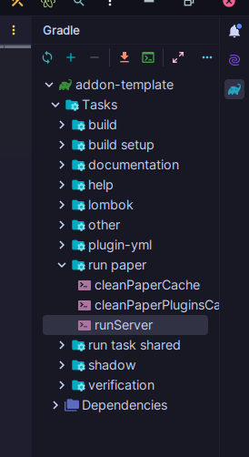
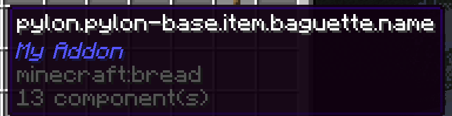

# 執行你的插件（Running your addon）

## 啟動測試伺服器（Starting a test server）

插件模板內建了一個「執行伺服器」任務，可直接在 IntelliJ 中啟動測試伺服器。  
打開 **Gradle** 面板，找到並雙擊 `runServer` 按鈕即可。  
這會在專案根目錄下建立一個新的 `run` 資料夾，其中包含測試伺服器。  
你可以自由修改這個伺服器——新增插件、調整設定檔、隨你所欲！



接著，你應該會看到伺服器輸出的控制台畫面。  
第一次執行時，系統會下載伺服器執行檔，可能需要一兩分鐘。  
由於尚未同意 EULA，第一次啟動會失敗。  
請前往剛建立的 `run` 資料夾，開啟 `eula.txt` 並接受 EULA，  
然後再執行一次 `runServer` 任務。

要關閉伺服器時，可在控制台輸入 `stop`，或在遊戲中使用 `/stop` 指令。  

!!! danger
    **請勿使用 IntelliJ 的停止按鈕來終止任務！**  
    這樣伺服器不會正常關閉，導致你無法真正停止它。  
    那樣伺服器將成為不死之身，吞噬一切。  
    **N̴o̶t̵h̶i̴n̴g̸ ̵a̶n̵d̷ ̸n̷o̷ ̴o̶n̸e̸ ̸i̷s̵ ̶s̸a̴f̴e̷.̵**  
    **Y̶̲̏O̵̫͘Ư̸͓ ̸̪̀S̸͚͊H̷̭̓A̵̢̾L̷̘͋L̷̻̿ ̴̾͜A̸̤̿L̸͇̾L̷̟̕ ̸̫̈B̴̊ͅÈ̴̹ ̴̺̉D̸̰̓Ë̵̪S̷̪̚Ṭ̸͒R̴̹̓Ǫ̵̓Ȳ̴̥Ê̶͙D̶̰̑ ̵͉͘B̷̘̌Y̴̽ͅ ̴̙̈T̷͚͒H̷̤͂Ẽ̷̥ ̸̨͗Ą̵̾L̴̦̒M̵̗͠I̵̱͛G̸͈͝H̷̫̀T̶̰̋Y̸͎̚ ̵̦̈́J̸̣̑V̴̭̌M̸̗̋.**

伺服器啟動後，你可以透過 `localhost:25565` 連線。  
別忘了在控制台輸入 `op <你的遊戲名稱>` 以獲取管理員權限。

---

## 取得你的物品（Getting the item）

現在，你可以獲得自己創建的物品了。  
使用 `/py give` 指令，例如：

```
/py give Idra my-addon:baguette
```

若一切設定正確，你應該會拿到你的法國麵包（baguette）。

但是等等……

這是怎麼回事？



注意到我們在建立法國麵包時並沒有設定名稱！  
若要為它加上名稱，就必須使用**語言系統（language system）**。  
別擔心，這部分非常簡單，我們會在下一章介紹。
